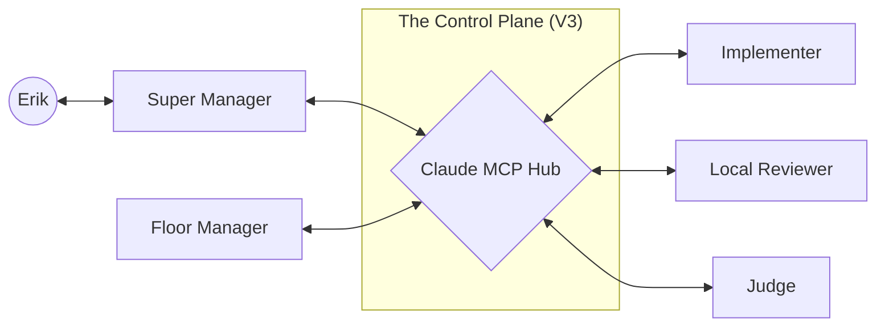

# 🏗️ Agentic Blueprint Setup V3: Direct Agent Communication (DAC)

**Version:** 3.0 (Alpha)
**Status:** Planning / Research
**Last Updated:** 2026-01-17
**Changelog:** Major pivot from file-based polling to direct Agent-to-Agent (A2A) communication via the Claude MCP Hub.

---

## 0. The Evolution: From V2 to V3

| Component | V2 (Asynchronous Polling) | V3 (Synchronous Negotiation) |
|-----------|---------------------------|------------------------------|
| **Communication** | Markdown files in `_handoff/` | MCP Tool Calls via `claude-mcp` |
| **Latency** | 5-30 seconds (Watchdog polling) | < 100ms (Direct invocation) |
| **Control Plane** | `watchdog.py` state machine | Managed Message Bus in MCP Hub |
| **Error Handling** | Circuit breakers halt the task | Agents negotiate and resolve in-session |
| **Visibility** | `transition.ndjson` | Real-time observability in MCP logs |

---

## 1. The Core Infrastructure: The Claude MCP Hub

The heart of V3 is a persistent MCP server (`claude-mcp`) that functions as a **Switchboard** for all agents.

### The "Antigravity Link" Protocol
Agents use a specific set of tools to interact with each other:

1.  **`send_message(recipient, payload)`**: Pushes a structured JSON message to another agent's inbox.
2.  **`receive_message()`**: Checks for incoming signals (interrupts, instructions, reviews).
3.  **`open_negotiation_channel(task_id)`**: Creates a temporary, high-bandwidth context shared between two agents for back-and-forth planning.

---

## 2. Updated Role Interactions

### The Super Manager <-> Floor Manager Negotiation
In V2, the Super Manager wrote a proposal and left. In V3:
1.  **Super Manager** drafts a proposal.
2.  **Floor Manager** receives `MESSAGE_PROPOSAL` via the Hub.
3.  **Negotiation Loop:** Floor Manager asks "Can Qwen handle this path?" → Super Manager clarifies → Floor Manager confirms.
4.  **Contract Creation:** Only AFTER negotiation is a `TASK_CONTRACT.json` finalized.

### The Real-time Review Loop
1.  **Implementer** finishes code.
2.  **Floor Manager** triggers `claude_mcp.call_review()`.
3.  **Judge (Claude)** reviews and sends `VERDICT_SIGNAL` directly back to the Floor Manager's session.
4.  If `FAIL`, the Floor Manager triggers an immediate `RETRY` while the context is still "hot."

---

## 3. The "Watchman" (Management Observability)

To solve the "Manager Stall" problem (where an orchestrator freezes), V3 introduces a **Heartbeat Monitor**.

- **Trigger:** If an agent is in an `active` state but hasn't sent an MCP signal in X minutes.
- **Action:** The Hub notifies the Architect (Erik) via a dedicated system tray notification (or simple CLI alert).

---

## 4. Transitioning from V2 to V3 (Phased Roadmap)

### Phase 7.1: The Mailbox (Bridge Mode)
- Keep file polling for backward compatibility.
- Add `send_message`/`receive_message` tools to `claude-mcp`.
- Agents start using messages for "FYI" status updates.

### Phase 7.2: The Hotline (Full DAC)
- Remove `REVIEW_REQUEST.md` and related file signals.
- All state transitions are triggered by MCP events.
- `watchdog.py` becomes a monitor of the Hub rather than the driver.

---

## 5. Architectural Diagram

---

*V3 is designed to treat AI Agents as a cohesive team rather than a set of isolated workers. The focus is on communication bandwidth as the primary bottleneck for complex engineering tasks.*
