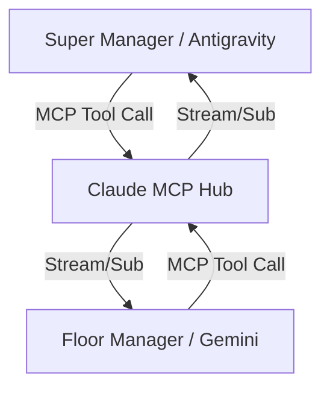

# Direct Communication Protocol: The "Antigravity Link"

**Status:** Draft / Research
**Target:** Phase 7 Implementation
**Goal:** Replace file-based handoffs with direct, synchronous Agent-to-Agent (A2A) communication via MCP.

## 1. The Core Problem
Currently, the Super Manager (Cloud) and Floor Manager (Local) communicate like "pen pals" via slow file drops (`PROPOSAL_FINAL.md`, `JUDGE_REPORT.md`):
- **High Latency:** Polling intervals delay reaction time.
- **Low Bandwidth:** Hard to have a back-and-forth negotiation.
- **Context Loss:** "Why did you decide this?" is lost in the static file.

## 2. The Solution: MCP as a Message Bus
We will utilize the **Model Context Protocol (MCP)** not just for tools, but as a **communication substrate**.

### Architecture: The "Claude MCP Hub"
We introduce a central, persistent MCP server (`claude-mcp`) that acts as the switchboard.

### 3. The Protocol (A2A over MCP)

We define a set of MCP Tools that function as communication verbs:

#### A. `send_message(to, content, priority)`
- **User:** Super Manager or Floor Manager
- **Action:** Pushes a structured message to the recipient's queue on the Hub.
- **Example:** `send_message("floor_manager", "Stop task DOC-001, requirements changed.", "high")`

#### B. `receive_messages(from, filter)`
- **User:** Recipient Agent
- **Action:** Polls (or streams) pending messages.
- **Example:** Floor Manager calls `receive_messages()` at the start of every cycle.

#### C. `negotiate_contract(proposal_id)`
- **User:** Interactive Session
- **Action:** Initiates a synchronous "chat session" stored in the Hub state, allowing reliable multi-turn negotiation before a file is ever written.

## 4. Implementation Strategy

### Step 1: The Mailbox (Async)
- Implement `claude-mcp` with an in-memory (or Redis-backed) message queue.
- Agents act as "Polling Clients" (like checking email).
- **Benefit:** Decoupled, robust, easy to bolt onto current `watchdog.py`.

### Step 2: The Hotline (Sync)
- Upgrade `claude-mcp` to support **MCP Resources** that are reactive.
- Agents subscribe to `mcp://messages/inbox`.
- **Benefit:** Real-time interruption (e.g., "STOP!" actually stops the agent immediately).

## 5. Comparison with Current State

| Feature | File Handoff (Current) | MCP Direct Link (New) |
|---------|------------------------|-----------------------|
| **Latency** | 5-30 seconds (Polling) | < 100ms (Direct) |
| **Richness** | Static Markdown | JSON/Structured Objects |
| **Flow** | Linear (Waterfall) | Cyclic (Negotiation) |
| **Reliability** | Medium (Race conditions) | High (Transactional) |

## 6. Next Steps
1. **Build `claude-mcp`:** The Node.js/Python server implementing the mailbox tools.
2. **Teach Floor Manager:** Update `agent-skills-library` to prioritize checking MCP messages over files.
3. **Upgrade Super Manager:** Give me access to the `claude-mcp` tools.
