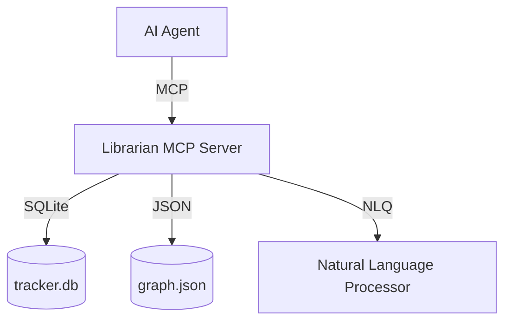

# Librarian MCP

The Librarian MCP server provides programmatic access to project knowledge stored in `tracker.db` and the knowledge graph (`graph.json`). It enables agents to search for files, projects, and dependencies using both structured queries and natural language.

## Architecture



## Tools

### Knowledge Discovery
- `search_knowledge`: Keyword search across projects and files.
- `get_project_info`: Detailed metadata for a specific project.
- `list_projects`: List all projects with status filtering.
- `find_related_docs`: Discover related files via graph traversal.

### Graph Analysis
- `get_dependencies`: Upstream and downstream dependency analysis.
- `find_connection`: Shortest path between two nodes in the graph.
- `get_project_graph`: Subgraph extraction for a specific project.

### Natural Language
- `ask_librarian`: Ask questions in plain English (e.g., "What depends on agent-hub?").

## Adaptive Memory Usage

The librarian learns from your feedback and usage patterns to provide faster, more accurate answers.

### Providing Feedback

The librarian learns from your feedback. After using `ask_librarian`:

**Mark helpful answers:**
```json
{
  "name": "librarian_feedback",
  "arguments": {
    "query": "How does agent hub work?",
    "helpful": true
  }
}
```

**Mark unhelpful answers:**
```json
{
  "name": "librarian_feedback",
  "arguments": {
    "query": "Where is X implemented?",
    "helpful": false
  }
}
```

**Effects:**
- Helpful answers: Confidence increases.
- Unhelpful answers: Confidence decreases, may be evicted from cache.

### Memory Management

**View memory stats:**
```json
{"name": "librarian_memory_stats"}
```

**Force caching (for frequently asked questions):**
```json
{
  "name": "librarian_remember",
  "arguments": {
    "question": "What is the Agent Hub?",
    "answer": "The Agent Hub is...",
    "tier": "hot"
  }
}
```

**Clear bad cache entries:**
```json
{
  "name": "librarian_forget",
  "arguments": {"query": "outdated question"}
}
```

## Configuration

The server can be configured via environment variables:
- `LIBRARIAN_PROJECTS_ROOT`: Base directory for project search.
- `LIBRARIAN_TRACKER_DB`: Path to `tracker.db`.
- `LIBRARIAN_GRAPH_JSON`: Path to `graph.json`.

## Integration with Claude Code

Add the following to your MCP configuration:

```json
{
  "mcpServers": {
    "librarian": {
      "command": "python3",
      "args": ["-m", "librarian_mcp.server"],
      "cwd": "/Users/eriksjaastad/projects/_tools/librarian-mcp/src"
    }
  }
}
```
